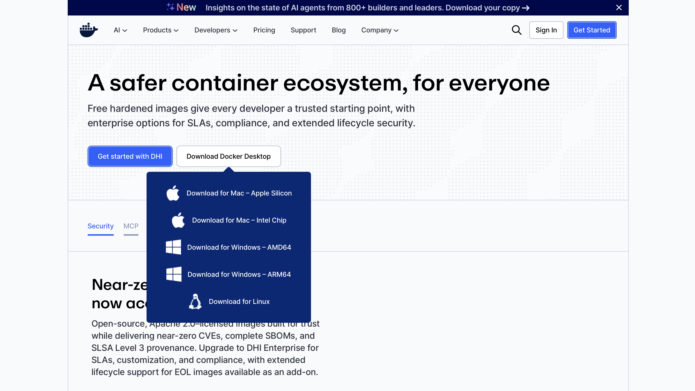
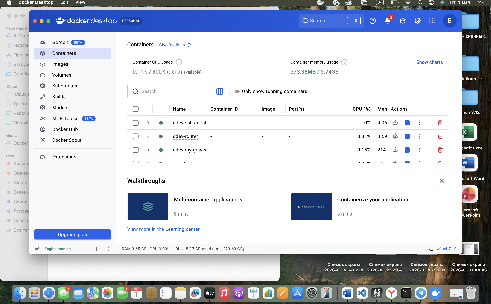
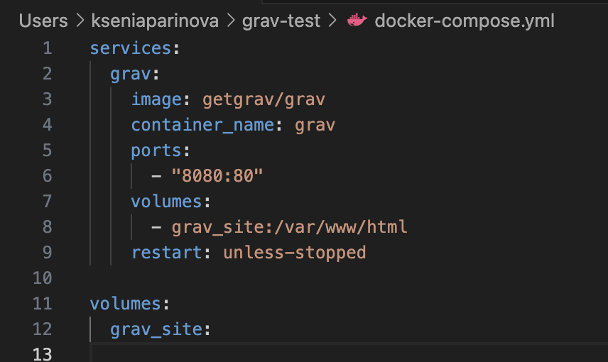
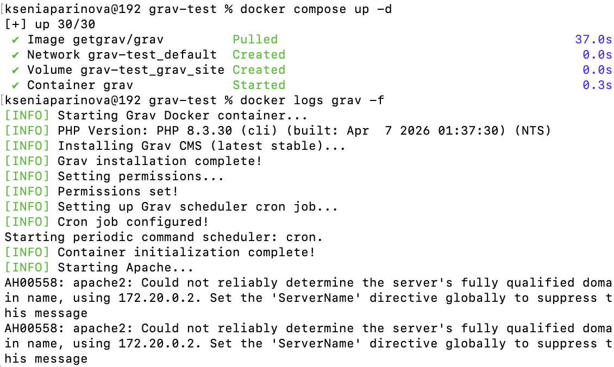
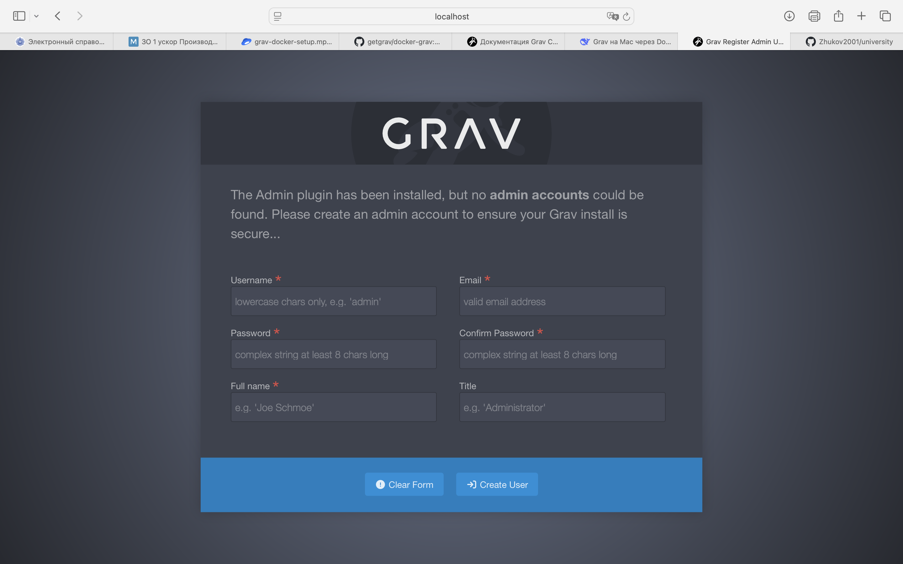
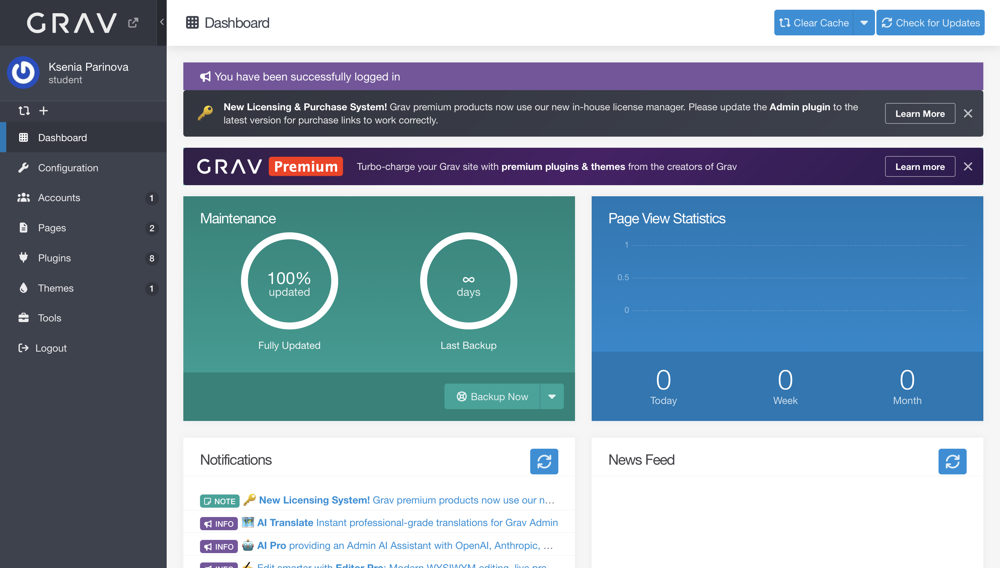
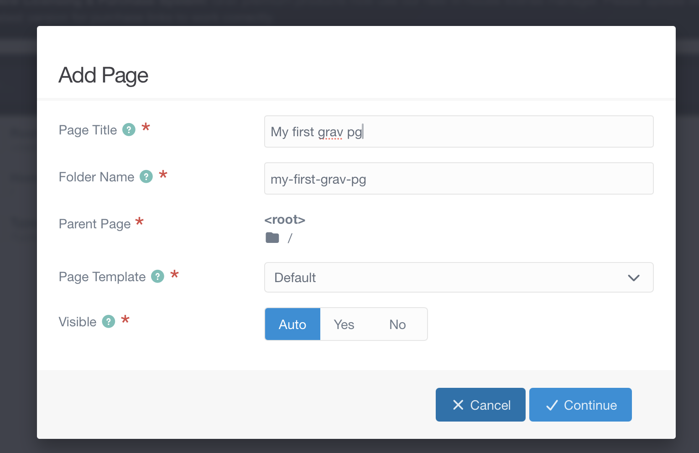
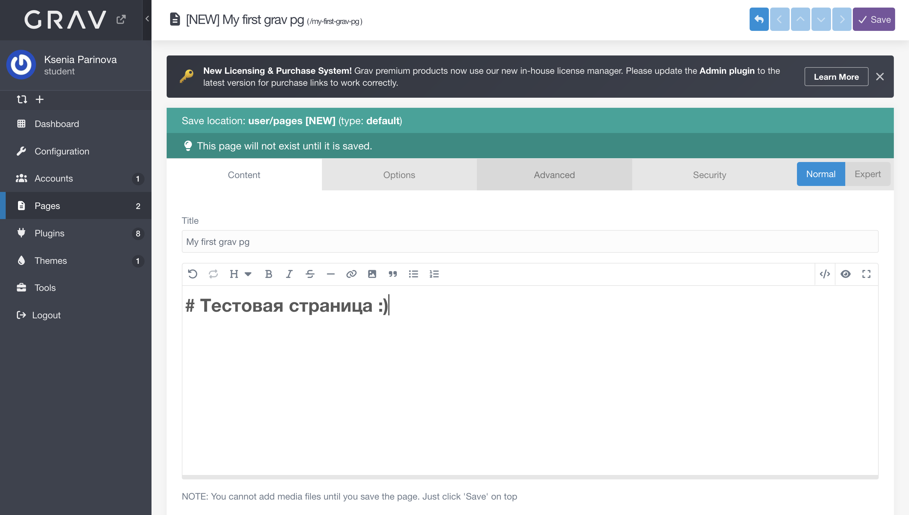
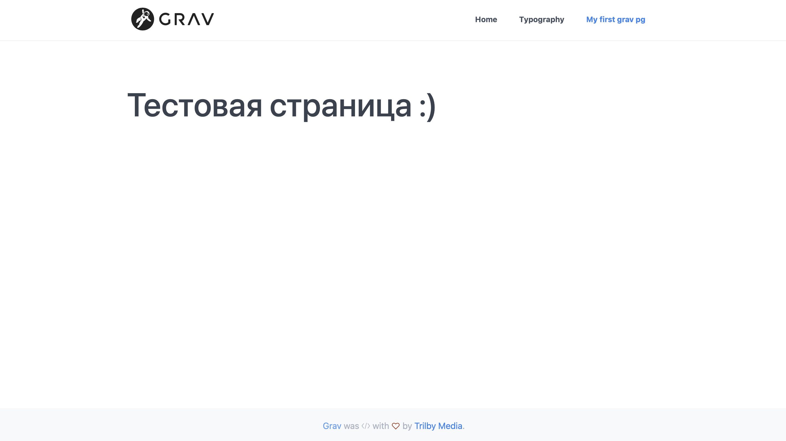

# Задание 1
## Часть 1
Установка Grav в Docker

### Установка Docker Desktop на компьютер

1.  С официального сайта **Docker** скачиваем установочный файл

2. После скачивания - проходим регистрацию и устанавливаем программу на компьютер - запускаем ее

3. В нашей папке создаём файл _docker-compose.yml_ и копируем в него содержимое того же файла из официального репозитория

4. Запуск контейнера при помощи _docker_ _compose_ _up_ _-d_

5. Затем открываем в браузере http://localhost:8080, мы должны увидеть следующие:

6. Проходим регистрацию и у нас открывается панель администратора, где мы должны в дальнейшем создать новую страницу

7. Вводим информацию, которая будет отображаться на странице и сохраняем

8. Переходим по ссылке http://localhost:8080 и мы должны увидеть на странице тот текст, что вводили в прошлом пункте

## Часть 2

### Изучить дизайн альтернативной версии сайта кафедры

#### Анализ альтернативной версии сайта кафедры на сервисе **Figma**

Сайт имеет типичную для университетской кафедры структуру:
- Герой-блок (Hero): слоган/миссия кафедры.
- Навигация: крупные блоки-ссылки на основные разделы ("О кафедре", "Абитуриентам" и т.д.).
- Трехуровневое футер-меню: колонки с разделами для абитуриентов, бакалавров, магистрантов.

Информативная, но не перегруженная. Меню охватывает все ключевые разделы кафедры.

### Найти 2 различные темы оформления для сайта CMS Grav

#### Тема №1 максимально похожа на альтернативный дизайн версии сайта кафедры в **Figma**

Используя интернет мной была найдена тема, наиболее похожая на альтернативный дизайн **TwentyFifteen**[https://demo.getgrav.org/twentyfifteen-skeleton/en]. На мой взгляд это один из приблеженных вариантов к альтернативной версии сайта: слева боковое меню, справа основная страница сайта

#### Тема №2 должна быть быть максимально адекватна специфике внешнего оформления сайта кафедры

В качестве референса использовала сайт СПБГУ [https://spbu.ru]. На мой взляд подходящей темой будет **Typhoon** [https://demo.getgrav.org/typhoon/onepage/], так как по своим внешним параметрам она наиболее схожа. Также, как вариант можно использовать тему **Deliver**[http://demo.getgrav.org/deliver-skeleton/]

## Часть 3

### Инсталлировать темы в развернутый локально сайт на Grav. И создать 1 информационную страницу в каждой теме, где можно было бы наглядно оценить её дизайн.

#### Тема №1 максимально похожа на альтернативный дизайн версии сайта кафедры в **Figma**

