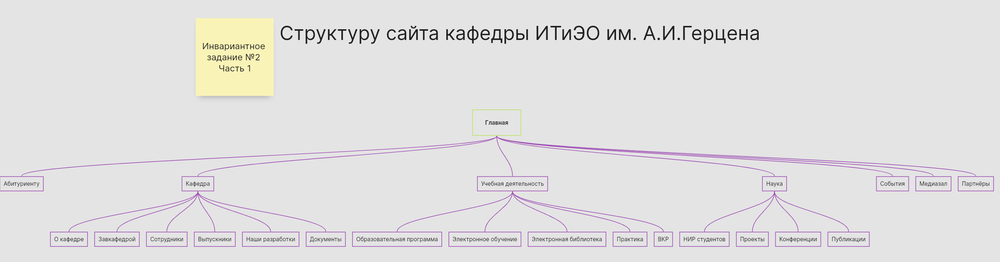
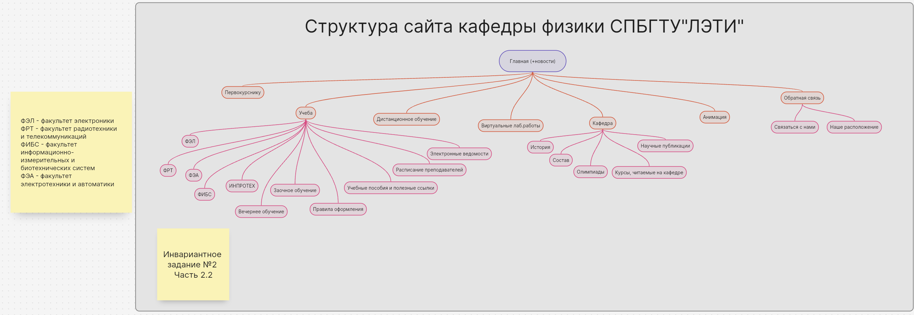

# Задание 2

## Часть 1

Исследовать структуру официального сайта кафедры информационных технологий и электронного обучения (ИТиЭО) и составить структуру сайта, используя сервис **Holst**

### Cтруктуру сайта кафедра ИТиЭО 

## Часть 2 

Проанализировать сайт другого вуза и составить структуры их сайтов. Провести сравнительный анализ проанализированных ресурсов и описать какие разделы отсутствуют на сайте кафедры ИТиЭО и вы бы рекомендовали добавить.

### Структура сайта факультета прикладной математики - процессов управления СПбГУ

### Сравнительный анализ 

Критерий для сравнения | Кафедра ИТиЭО (РГПУ им. Герцена) | Кафедра физики СПБГТУ"ЛЭТИ"
--- | --- | ---
Раздел для студентов | Нет | Нет
Раздел для абитуриентов | Есть | Нет
Раздел для сотрудников | Нет | Нет
Раздел о самой кафедре | Есть | Есть
Библиотека | Нет | Есть
Новости / События | Есть | Есть
Учебные планы и программы | Есть | Есть
Заочное обучение | Нет | Есть
Олимпиады | Нет | Есть
Расписание преподавателей | Нет | Есть
Состав кафедры | Нет | Есть
Электронные ведомости | Нет | Есть
Обратная связь | Нет | Есть

#### Вывод
Проанализировав две структуры разных кафедр, мож
